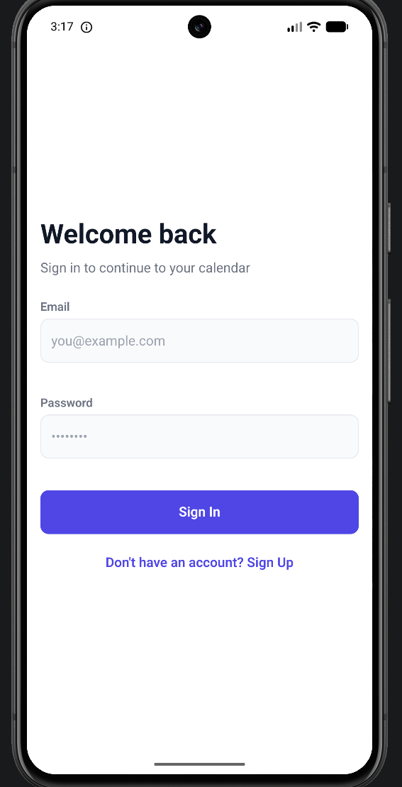
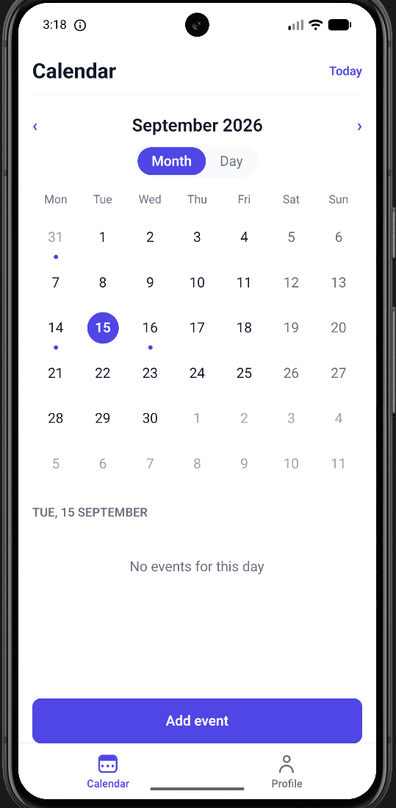
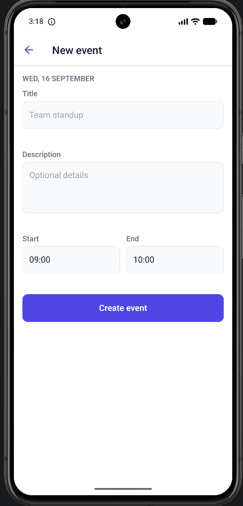
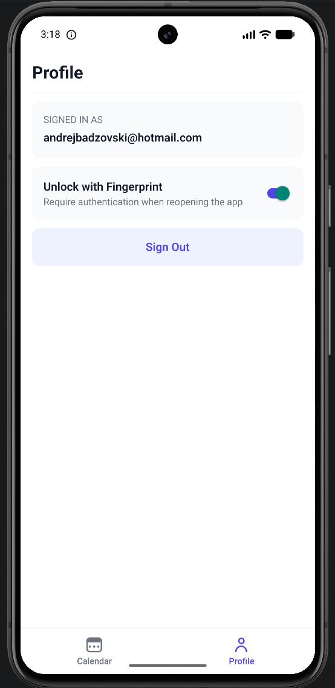
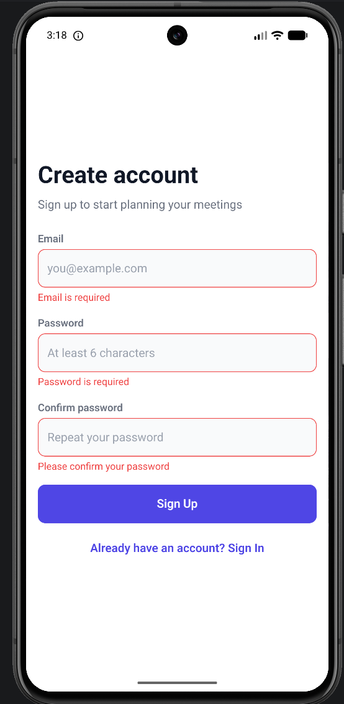
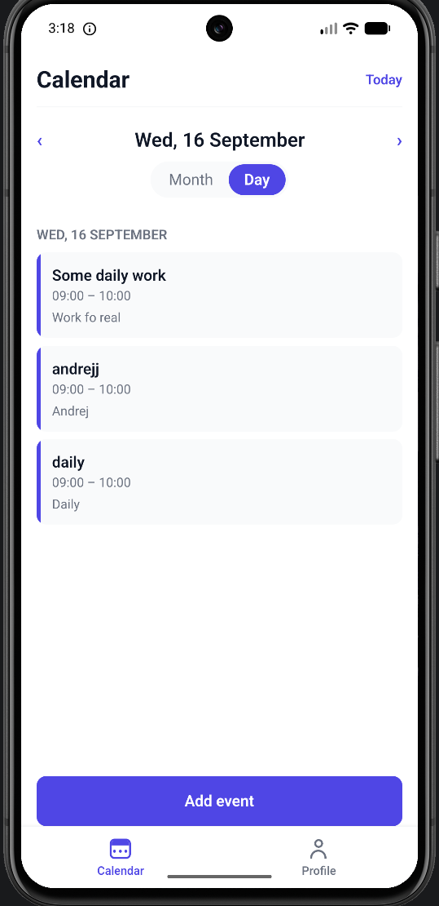
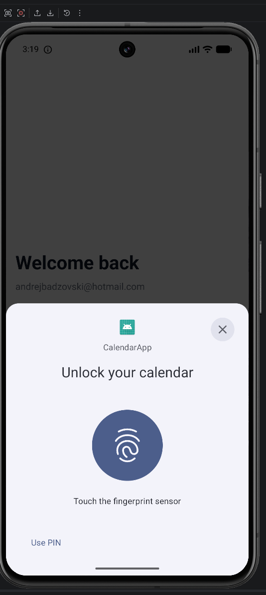

# Calendar App

A React Native calendar application with email/password authentication, biometric app lock, and meeting (event) management backed by Firebase.

The calendar is built from scratch — no third-party calendar component and no date library. All UI components are custom; no component kit is used.

---

## Screenshots

| Sign In | Calendar (month) | Event form | Profile |
|---|---|---|---|
|  |  |  |  |

| Sign Up | Calendar (day view) | Biometric lock |
|---|---|---|
|  |  |  |

---

## Features

**Authentication**
- Sign up with email and password, with client-side field validation
- Sign in for existing accounts
- Session token persisted across app restarts
- Biometric app lock — a returning user unlocks with fingerprint/face instead of re-entering credentials
- Sign out from the Profile screen

**Calendar**
- Custom month grid, Monday-first, with today, selected day, and adjacent-month days distinguished
- Switch between **Month** and **Day** views
- Event indicator dots on days that have meetings
- Events for the selected day listed below the grid, with pull-to-refresh

**Events**
- Create a meeting with title, description, start and end time
- Edit an existing meeting
- Delete a meeting
- Validation for required fields, 24-hour time format, and end-after-start

**Platform**
- Safe-area handling via measured insets, so the layout adapts to notches, punch-holes and gesture bars
- App header and bottom tab navbar
- Native screen transition animations (stack push, modal slide-up)

---

## Tech stack

| Area | Choice |
|---|---|
| Framework | React Native 0.87.1 (React Native CLI — **not** Expo) |
| Language | TypeScript 6.0.3 (`strict`, plus `noUncheckedIndexedAccess`) |
| Navigation | React Navigation 7 (native stack + bottom tabs) |
| Authentication | Firebase Authentication (email/password) |
| Database | Cloud Firestore |
| Biometrics | `react-native-biometrics` |
| Local storage | AsyncStorage (Firebase session persistence, biometric preference) |
| Styling | React Native `StyleSheet` with a custom design-token layer |
| Testing | Jest + React Native Testing Library |

### Dependency notes

Only libraries providing capabilities the task requires are used:

| Library | Reason |
|---|---|
| `@react-navigation/*`, `react-native-screens` | Routing is a stated requirement and React Native has no built-in router |
| `react-native-safe-area-context` | Measured safe-area insets for notch handling |
| `firebase`, `@firebase/auth` | Authentication and event storage |
| `react-native-biometrics` | Biometric authentication needs native platform APIs |
| `@react-native-async-storage/async-storage` | Required by Firebase Auth to persist sessions on React Native |

Deliberately **not** used: any calendar component, any date library (`date-fns`, `moment`, `dayjs`), and any UI component kit. The month grid, all date arithmetic, and every UI component are implemented in this repository.

> `@firebase/auth` is imported directly rather than through `firebase/auth` because only the inner package declares a `react-native` export condition, which is required for `getReactNativePersistence`.

---

## Prerequisites

| Requirement | Version used |
|---|---|
| Node.js | 20.20.2 (Node 20 LTS or newer) |
| npm | 10.8.2 |
| JDK | 25 (bundled with Android Studio) |
| Android Studio | Narwhal or newer |
| Android SDK Platform | API 36–37 |
| Android Build Tools | 37.0.0 |
| Gradle | 9.4.1 (via the included wrapper) |
| Kotlin | 2.2.0 |
| NDK | 27.1.12297006 |
| Minimum Android API | 24 (Android 7.0) |
| Target Android API | 36 |
| Xcode (iOS only) | 16 or newer |
| CocoaPods (iOS only) | 1.15 or newer |

### Environment variables

Add to your shell profile (`~/.zshrc` or `~/.bashrc`):

```bash
export ANDROID_HOME=$HOME/Library/Android/sdk
export JAVA_HOME="/Applications/Android Studio.app/Contents/jbr/Contents/Home"
export PATH=$PATH:$ANDROID_HOME/emulator:$ANDROID_HOME/platform-tools
```

---

## Setup

### 1. Install dependencies

```bash
npm install
```

### 2. Create a Firebase project

1. Open the [Firebase Console](https://console.firebase.google.com) and create a project.
2. **Build → Authentication → Get started → Email/Password → Enable.**
3. **Build → Firestore Database → Create database.**
4. **Project settings → Your apps → Web (`</>`)** → register an app and copy the generated config values.

### 3. Add the Firebase configuration

The config file is git-ignored. Copy the example and fill in your project values:

```bash
cp src/config/firebase.config.example.ts src/config/firebase.config.ts
```

```ts
export const firebaseConfig = {
  apiKey: '...',
  authDomain: '...',
  projectId: '...',
  storageBucket: '...',
  messagingSenderId: '...',
  appId: '...',
};
```

### 4. Create the required Firestore index

Events are queried by `userId` and ordered by `startsAt`, which Firestore serves through a **composite index**.

On first run Firestore returns an error containing a link that creates the index automatically — open it and click **Create index**. To add it manually instead:

- Collection: `events`
- Fields: `userId` (Ascending), `startsAt` (Ascending)
- Query scope: Collection

### 5. Firestore security rules

The database is created in test mode by default. For anything beyond local evaluation, restrict access so users can only read and write their own events:

```
rules_version = '2';
service cloud.firestore {
  match /databases/{database}/documents {
    match /events/{eventId} {
      allow read, delete: if request.auth != null
        && request.auth.uid == resource.data.userId;
      allow create: if request.auth != null
        && request.auth.uid == request.resource.data.userId;
      allow update: if request.auth != null
        && request.auth.uid == resource.data.userId
        && request.auth.uid == request.resource.data.userId;
    }
  }
}
```

---

## Running the app

Start the Metro bundler in one terminal:

```bash
npm start
```

### Android

With an emulator running or a device connected:

```bash
npm run android
```

If the app shows a blank screen with "Cannot connect to Metro", forward the port:

```bash
adb reverse tcp:8081 tcp:8081
```

### iOS

```bash
cd ios && pod install && cd ..
npm run ios
```

> iOS has not been verified on this machine — no Xcode installation was available during development. The iOS project is present and the source is shared, but the build is untested.

---

## Testing biometrics on an emulator

1. Enrol a screen lock and fingerprint: **Settings → Security → Screen lock** (set a PIN), then **Fingerprint**.
2. When prompted to touch the sensor, simulate a touch from your terminal, repeating until enrolment completes:

```bash
adb -s emulator-5554 emu finger touch 1
```

3. In the app: **Profile → Unlock with Fingerprint → on**, then fully close and reopen the app. The lock screen appears; authenticate with the same command.

---

## Scripts

| Command | Description |
|---|---|
| `npm start` | Start the Metro bundler |
| `npm run android` | Build and run on Android |
| `npm run ios` | Build and run on iOS |
| `npm run typecheck` | Type-check with no emit |
| `npm run lint` | Run ESLint |
| `npm test` | Run the test suite |
| `npm run test:coverage` | Run tests with a coverage report |

---

## Tests

```bash
npm run test:coverage
```

96 tests across 7 suites.

| Metric | Coverage |
|---|---|
| Statements | 30.8% |
| Branches | 31.6% |
| Functions | 34.2% |
| Lines | 30.5% |

Coverage is concentrated where correctness is hardest to verify by inspection:

| Module | Statements |
|---|---|
| `utils/validation.ts` | 100% |
| `utils/events.ts` | 100% |
| `utils/date.ts` | 92% |
| `features/calendar/components/MonthGrid.tsx` | 100% |
| `features/events/hooks/useEvents.ts` | 100% |

Tests cover the date engine (leap years, century non-leap years, month and year rollovers, Monday-first ordering, grid completeness), form validation, event grouping, component behaviour, and hook data flow with the repository mocked.

No snapshot tests are used — they pass without asserting behaviour and break on unrelated style changes.

---

## Project structure

```
src/
├── components/ui/      Shared presentational components (design system)
├── config/             Firebase configuration (git-ignored)
├── features/
│   ├── auth/           Auth context, sign in/up, biometric lock
│   ├── calendar/       Calendar screen, month grid, calendar header
│   ├── events/         Event list, event form, events hook
│   └── profile/        Profile screen
├── navigation/         Navigators and typed route definitions
├── repositories/       Data-access interfaces and Firebase implementations
├── services/           Firebase, biometrics and preference wrappers
├── theme/              Design tokens (colors, spacing, typography, radius)
├── types/              Shared domain types
└── utils/              Pure helpers (date engine, validation, event grouping)
```

### Architecture

- **Repository pattern.** Screens and hooks depend on the `AuthRepository` and `EventRepository` interfaces, never on Firebase directly. `src/repositories/index.ts` is the single place the concrete implementation is chosen, so the backend can be replaced without touching UI code. This is also what makes the hook tests possible without a running backend.
- **Error translation at the boundary.** Firebase error codes are mapped to domain errors inside the repositories, so vendor-specific strings never reach the UI. Sign-in failures are deliberately collapsed into a single message to avoid disclosing which email addresses have accounts.
- **Structural auth guard.** Authenticated screens are not mounted at all while signed out — the navigator renders a different tree rather than redirecting, so protected routes cannot be reached.
- **Typed navigation.** Route parameters are typed per navigator, so navigating to an unknown screen or passing the wrong params is a compile error.
- **Design tokens.** All colours, spacing and typography come from `src/theme`; components contain no literal style values.
